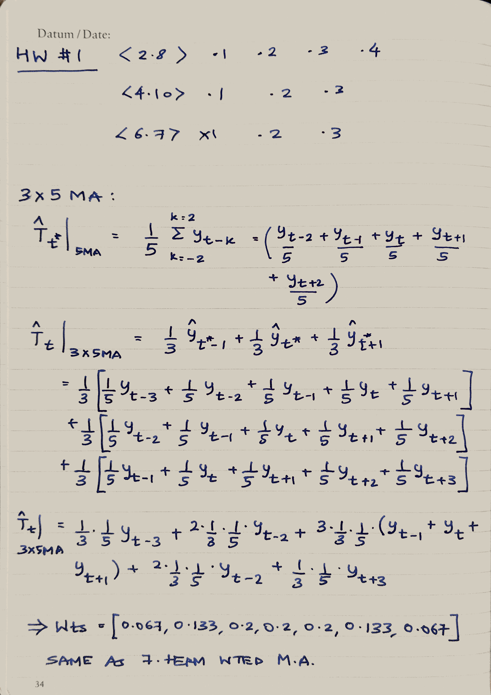

```{r include=FALSE}
library(fpp)
library(ggplot2)
library(magrittr)
library(dplyr)
library(fma)
```

## Secion 2.8

### For each of the following series (from the fma package), make a graph of the data. If transforming seems appropriate, do so and describe the effect.

#### Monthly total of people on unemployed benefits in Australia (January 1956–July 1992).
```{r out.width= '70%', fig.align='center'}
plot(dole)
plot(BoxCox(dole,lambda = BoxCox.lambda(dole)),
     main=paste0('lamda = ',round(BoxCox.lambda(dole),2)))
```

#### Monthly total of accidental deaths in the United States (January 1973–December 1978).
```{r out.width= '70%', fig.align='center'}
plot(usdeaths)
plot(BoxCox(usdeaths,lambda = BoxCox.lambda(usdeaths)),
     main=paste0('lamda = ',round(BoxCox.lambda(usdeaths),2)))
```

#### Quarterly production of bricks (in millions of units) at Portland, 
#### Australia (March 1956–September 1994).
```{r out.width= '70%', fig.align='center'}
plot(bricksq)
plot(BoxCox(bricksq,lambda = BoxCox.lambda(bricksq)),
     main=paste0('lamda = ',round(BoxCox.lambda(bricksq),2)))
```

### Use the Dow Jones index (data set dowjones) to do the following:

#### Produce a time plot of the series.
```{r out.width= '70%', fig.align='center'}
plot(dowjones)
```

#### Produce forecasts using the drift method and plot them.
```{r out.width= '70%', fig.align='center'}
plot(rwf(dowjones,h=10, drift = T))
```

#### Show that the graphed forecasts are identical to extending the line drawn between the first and last observations.
```{r out.width= '70%', fig.align='center'}
ggplot2::autoplot(rwf(dowjones,h=10, drift = T))+
    geom_abline(intercept = dowjones[1], slope = (dowjones[78] - dowjones[1])/78, 
                color = 'red', lty=2)
```

#### Try some of the other benchmark functions to forecast the same data set. Which do you think is best? Why?
Perhaps the naive is a bit better than the drift model since atleast it doesn't predict the signal is going to increase! But, all of these are quite bad.
```{r out.width= '70%', fig.align='center'}
ggplot2::autoplot(naive(dowjones, h=10))
ggplot2::autoplot(meanf(dowjones, h=10))
```

### Consider the daily closing IBM stock prices (data set ibmclose).

#### Produce some plots of the data in order to become familiar with it.
```{r out.width= '70%', fig.align='center'}
plot(ibmclose)
```

#### Split the data into a training set of 300 observations and a test set of 69 observations.
```{r}
train <- window(ibmclose, end = 300)
test <- window(ibmclose, start = 301)
```

#### Try various benchmark methods to forecast the training set and compare the results on the test set. Which method did best?
```{r}
nv <- naive(train)
snv <- snaive(train)
mf <- meanf(train)
drft <- rwf(train,drift = T)
forecast(nv, test) %>% accuracy
forecast(snv, test) %>% accuracy
forecast(mf, test) %>% accuracy
forecast(drft, test) %>% accuracy
```

Looks like (using RMSE, MPE) the drift method seems (marginally) the better one.

### Consider the sales of new one-family houses in the USA, Jan 1973 – Nov 1995 (data set hsales).

#### Produce some plots of the data in order to become familiar with it.
```{r out.width= '70%', fig.align='center'}
plot(hsales)
```

#### Split the hsales data set into a training set and a test set, where the test set is the last two years of data.
```{r}
train <- window(hsales, end = 1992)
test <- window(hsales, start = 1993)
```

#### Try various benchmark methods to forecast the training set and compare the results on the test set. Which method did best?
```{r}
nv <- naive(train)
snv <- snaive(train)
mf <- meanf(train)
drft <- rwf(train,drift = T)
forecast(nv, test) %>% accuracy
forecast(snv, test) %>% accuracy
forecast(mf, test) %>% accuracy
forecast(drft, test) %>% accuracy
```

Using MASE, we can see that the naive  or drift forecasts do fairly better than the others in this case.

## Section 4.10

### 1. Electricity consumption was recorded for a small town on 12 randomly chosen days.

Here's what the electricity consumption data looks like:

```{r}
head(econsumption)
```

#### a. Plot the data and find the regression model for Mwh with temperature as an explanatory variable. Why is there a negative relationship?

Here's a plot of consumption by temperature.

```{r out.width= '70%', fig.align='center'}
lattice::xyplot(Mwh~temp, econsumption, type=c('p','r'), 
                main = 'Consumption by Temp (C)', 
                sub='Blue line shows linear regression fit')
```

Building a linear model:

```{r}
fit <- lm(Mwh~temp, econsumption)
summary(fit)
```

Both the coefficients are statistically significant at the 0.01 level, with a negative slope for temperature. The temperature range in question is between 10C and 30C, which would indicate that the increase in electric consumption as temperature reduces is due to usage of electric heaters in households. Thus the slope is negative.

#### b. Produce a residual plot. Is the model adequate? Are there any outliers or influential observations?

The model seems OK. There are two main outliers - 3 and 8, which show up with higher residuals, high Cook's distance. Pt 7 also has high Cook's distance. Though, if we look at the leverage statistics, we see that neither 3 nor 8 have high leverage, i.e. they don't really pull the regression line one way or the other. Pt 7, on the other hand, is at the left end of the regression line and has a higher leverage.

```{r out.width= '70%', fig.align='center'}
econsumption$id <- 1:12
ggplot(econsumption, aes(x=temp,y=Mwh))+geom_smooth(se = F,method = 'lm') +
    geom_label(aes(label=id))
```
```{r fig.align='center', message=FALSE, warning=FALSE}
old.par <- par(); par(mfrow=c(2,2), mar=c(2,2,2,1))
plot(fit, which = c(1,2,4,5)) ;par(old.par)
```

  #### c. Use the model to predict the electricity consumption that you would expect for a day with maximum temperature 10C and a day with maximum temperature 35C. Do you believe these predictions?

* The prediction at 10C does make sense. It falls within the cluster of points in that region and seems like a useful estimate.
* The prediction at 35C extrapolates the data and is more suspect. It's possible that as it get's warmer, the air conditioning load would increase and this power consumption too.

```{r out.width= '70%', fig.align='center'}
preds <- data.frame(temp=c(10,35))
preds$Mwh <- predict(fit,newdata = preds)
preds$type <- 'yhat'
econsumption$type <- 'original'
econsumption <- bind_rows(econsumption, preds)
lattice::xyplot(Mwh~temp,groups=type,econsumption,auto.key=T,type=c('p','r'),
                main='Electric consumption vs Max daily Temp')
```

#### d. Give prediction intervals for your forecasts.

These are the prediction intervals for a 95% CI.

```{r}
predict(fit,newdata = preds, interval = 'predict', level = 0.95)
```

### 2. The following table gives the winning times (in seconds) for the men’s 400 meters final in each Olympic Games from 1896 to 2012...

#### a. Update the data set `olympic` to include the winning times from the last few Olympics.

```{r}
# Source: https://www.olympic.org/athletics/400m-men
olympic <- olympic %>% bind_rows(tribble(~Year, ~time, 2000, 43.84,2004, 44.00,2008, 
                                         43.75,2012, 43.94,2016, 43.03))
tail(olympic,8)
```

#### b. Plot the winning time against the year. Describe the main features of the scatterplot.

* The winning time is consistantly decreasing
* The plot seems to be getting asymptotic in nature
* The variation across time seems to be continously reducing

```{r out.width= '70%', fig.align='center'}
lattice::xyplot(time~Year,olympic,type=c('p','r'),ylab='Winning time (s)')
```

#### c. Fit a regression line to the data. Obviously the winning times have been decreasing, but at what *average* rate per year?

The winning times reduce by 0.064 seconds on average year over year.

```{r}
summary(lm(time~Year, olympic))
```

#### d. Plot the residuals against the year. What does this indicate about the suitability of the fitted line?

```{r fig.align='center', message=FALSE, warning=FALSE}
old.par <- par(); par(mfrow=c(2,2), mar=c(2,2,2,1))
plot(lm(time~Year, olympic), which = c(1,2,4,5)); par(old.par)
```

A linear fit isn't the right one for this data, as we can already see from the scatter plots. The residuals confirm this:

* There is a pattern in the residuals^yhat plot - Higher residuals at the beginning, then lower, then higher again. We can also confirm this from the Durbin-Watson statistic, which is ~1.2 with a p-val of 0.008 indicating we must reject the null hypothesis Ho: There is no autocorrleation in the residuals.

```{r}
lmtest::dwtest(lm(time~Year, olympic))
```
* QQplot and Cook's distance plots show pt-1 as a massive outlier
* The leverage plot also confirms pt-1 to show high leverage

#### Predict the winning time for the men’s 400 meters final in the 2000, 2004, 2008 and 2012 Olympics. Give a prediction interval for each of your forecasts. What assumptions have you made in these calculations?

I would first eliminate the first point because it's a clear outlier.

```{r out.width= '70%', fig.align='center'}
olympic <- tail(olympic,-1)
lattice::xyplot(time~Year,olympic,type=c('p','r'),ylab='Winning time (s)')
```
Fitting a new regrssion line, and predicting the last 4 years now. The printout shows the prediction interval at a 95% confidence.

```{r}
fit <- lm(time~Year, olympic)
olympic <- olympic %>% bind_cols(tbl_df(predict(fit, interval = 'predict', level = 0.95)))
tail(olympic)
```

These calculations assume:

* Each observation is IID
* There is no effect of seasonality or external factors considered (location, temperature, humidity etc)

#### e. Find out the actual winning times for these Olympics (see www.databaseolympics.com). How good were your forecasts and prediction intervals?

The linear trend cannot account for the uptick in winning times between 2000 and 2012. So the actuals do lie between the 95% PI yet we can see that the actuals start approaching the ends of the error bars at 2012.

```{r out.width= '70%', fig.align='center'}
olympic %>% filter(Year %in% c(2000,2004,2008,2012)) %>% mutate(e = time - fit) %>% 
    ggplot(aes(x=Year))+
    geom_errorbar(aes(ymin=lwr,ymax=upr))+
    geom_point(aes(y=fit))+
    geom_point(aes(y=time),col='red')+
    scale_x_continuous(breaks = c(2000,2004,2008,2012))+
    labs(y='Winning time (s)', caption = 'Red points - actual winning values')
```

### 3. An elasticity coefficient is the ratio of the percentage change in the forecast variable (y) to the percentage change in the predictor variable (x)... Express y as a function of x and show that the coefficient beta1 is the elasticity coefficient.


***

## Section 6.7

### 1. Show that a 3x5MA is equivalent to a 7-term weighted moving average with weights of 0.067, 0.133, 0.200, 0.200, 0.200, 0.133, and 0.067.

* See next page * 



### 2. `plastics` dataset question

The dataset:
```{r}
plastics
```

#### a. Plot the time series of sales of product A. Can you identify seasonal fluctuations and/or a trend?

```{r message=FALSE, warning=FALSE, out.width= '70%', fig.align='center'}
ggplot2::autoplot(plastics, main ='Monthly sale (in thou) of Product A')+
    ggplot2::geom_smooth(se = F)
```
* Seasonal fluctuations exist, with peaks ~Aug-Sep and reduced sales at the year end
* A monotonic near-linear trend also exists year over year

#### b. Use a classical multiplicative decomposition to calculate the trend-cycle and seasonal indices.

```{r}
multi_decomp <- decompose(plastics, type = 'multiplicative')
```
The trend and seasonal indices can be accessed via:
```{r}
multi_decomp$trend
multi_decomp$seasonal
```

#### c. Do the results support the graphical interpretation from part (a)?
```{r out.width= '70%', fig.align='center'}
ggplot2::autoplot(multi_decomp)
```

Yes

* We can see a clear increasing trend
* We can see that the seasonality has extracted a lot of the variation from the original series. 
* Once the in a linear trend is removed, a majority of the variation is explained by the seasonal component - most of the remainder is ~1. At places where it's not equal to one, the magnitudes are fairly small: [-0.025,0.05] about 1 compared to that of seasonal [-0.3, 0.2] about 1.

#### d. Compute and plot the seasonally adjusted data.

```{r out.width= '70%', fig.align='center'}
ggplot2::autoplot(seasadj(multi_decomp), ylab='Seasonally adjusted sales')
```

#### e. Change one observation to be an outlier (e.g., add 500 to one observation), and recompute the seasonally adjusted data. What is the effect of the outlier?

```{r out.width= '70%', fig.align='center'}
plastics.withoutlier <- plastics
plastics.withoutlier[7] <- plastics.withoutlier[7] + 800
ggplot2::autoplot(decompose(plastics.withoutlier, type = 'multiplicative'))
```
* Classic decomposition is not robust to outliers.
* It affects the seasonal contributions throughout the time series, since `decompose()` cannot adjust seasonal contributions over time.
* As a result, we can see high residuals at (T+7) throughout the time series.

#### f. Does it make any difference if the outlier is near the end rather than in the middle of the time series?

```{r out.width= '70%', fig.align='center'}
plastics.withoutlier1 <- plastics
plastics.withoutlier1[20] <- plastics.withoutlier[20] + 800
plastics.withoutlier2 <- plastics
plastics.withoutlier2[59] <- plastics.withoutlier[59] + 800
ggplot2::autoplot(decompose(plastics.withoutlier1, type = 'multiplicative'))+
    labs(title='Spike in the middle')
ggplot2::autoplot(decompose(plastics.withoutlier2, type = 'multiplicative'))+
    labs(title='Spike at the end')
```

Yes.

The reason is that when the spike is at the end, if that portion of the signal is `NA` in the trend extraction using MA, it is not considered during calculation of the seasonal contributions.

#### g. Use a random walk with drift to produce forecasts of the seasonally adjusted data.

To extract the seasonally adjusted data:
```{r out.width= '70%', fig.align='center'}
sadj <- seasadj(multi_decomp)
ggplot2::autoplot(sadj)
```

Adding the random walk here, shown in red.

```{r out.width= '70%', fig.align='center'}
h <-  12
mu <- tail(sadj, 1) 
rwalk <- as.numeric(mu) + cumsum(rnorm(h,))
rwalk <- ts(rwalk, frequency = 12, start = c(6,1))
together <- ts.union(sadj, rwalk)
plot(together, main = 'Seasonally adj timeseries & random walk forecast for 12 months',
     plot.type = 's',col=c('black','red'), ylab = 'Sales')
```

#### h. Reseasonalize the results to give forecasts on the original scale.

Multiplying the seasonal component to the multiplicative series, we get results back in the original scale.

```{r out.width= '70%', fig.align='center'}
rwalk_reseasoned <- rwalk * as.numeric(multi_decomp$seasonal)[1:12]
together <- ts.union(sadj, rwalk_reseasoned)
plot(together, main = 'Random walk forecast for 12 months',plot.type = 's',
     col=c('black','red'), ylab = 'Sales')
```

